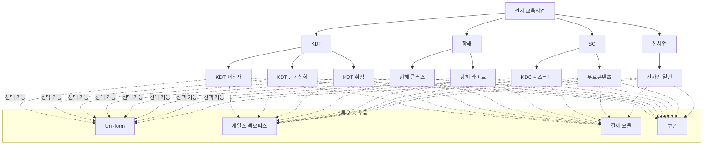

# 2025-08-13_[5CH] 그로스 스쿼드 목표

| Property | Value |
| --- | --- |
| created_date | 2025-08-13 |
| id | 24e2dc3e-f514-80b5-8d0c-f1bcee24af07 |
| url | https://www.notion.so/5CH-24e2dc3ef51480b58d0cf1bcee24af07 |
| perf_flag | yes |
| importance | 5 |
| summary_5lines | |
|  | - 지금까지는 고객의 문제를 피상적으로만 인지했을 뿐, 이를 실제 전환 개선으로 연결하는 기능 실험은 부족했다. |
|  | - 정량 데이터 분석과 정성 인터뷰를 통해 고객의 숨겨진 문제를 명확히 규명하고, 그 문제를 실제로 해결할 수 있는 기능/실험을 도출·런칭한다. |
|  | - 이번 CH에서는 정량 데이터 분석과 정성 인터뷰를 통해 고객의 숨겨진 니즈를 발굴하고, 이를 풀어낼 수 있는 기능과 실험으로 이어가야 한다. 그래야 “문제를 아는 데서 멈추는 조직”이 아니라, 문제를 실제로 해결하는 스쿼드로 자리매김할 수 있다. |
|  | - Objective2 - 고객의 숨은 페인포인트를 해결하는 실험 기능 런칭 |
|  | - Objective1 - 프로덕트 안정화 및 정책 인지를 통해 실험·운영 기반을 다진다. |

Original: https://www.notion.so/5CH-24e2dc3ef51480b58d0cf1bcee24af07

- ▶ 2025년도 비전/목적/미션

## Objective1 - **프로덕트 안정화 및 정책 인지를 통해 실험·운영 기반을 다진다.**
> 💡  리브랜딩, 프레이머 이관, 브레이즈 도입 기반 마련, 비즈니스/디자인/코드 정책 문서화를 통해 프로덕트가 안정적으로 운영, 이후에 간결하게 실험할 수 있는 상태를 만든다.** **

  ---

### 🎯 Why
  현재는 파편화된 기능과 모호한 정책으로 인해 동일 문제를 반복 해결하고, “버그인지 기능인지”조차 구분하기 어려운 상황이다.
  이로 인해 운영 비효율과 불필요한 커뮤니케이션 비용이 증가하고, 실험 속도도 늦어진다.
  이번 CH에서는 리브랜딩/브레이즈/프레이머 안정화와 같은 핵심 안정화 과제를 완수하고, 
  동시에 비즈니스/코드 정책을 통합·문서화하여 누구나 명확하게 인지할 수 있는 기반을 마련한다.
  이것이 곧 향후 빠른 실험과 확장 가능한 전사적 플랫폼화의 토대가 된다.

## Objective2 - 고객의 숨은 페인포인트를 해결하는 실험 기능 런칭
> 💡  정량 데이터 분석과 정성 인터뷰를 통해 고객의 숨겨진 문제를 명확히 규명하고, 그 문제를 실제로 해결할 수 있는 기능/실험을 도출·런칭한다.
  - 단순히 니즈를 “인지”하는 데 그치지 않고, 반드시 기능/실험으로 연결하여 전환 개선과 러닝 축적을 만들어낸다.

  ---

### 🎯 Why
  KDC의 메인 타겟(특히 시니어 고객군)은 기존 퍼널에서 이탈률이 높고, 실제로 어떤 부분에서 어려움을 겪는지 정량 지표만으로는 드러나지 않는다.
  지금까지는 고객의 문제를 피상적으로만 인지했을 뿐, 이를 실제 전환 개선으로 연결하는 기능 실험은 부족했다.
  이번 CH에서는 정량 데이터 분석과 정성 인터뷰를 통해 고객의 숨겨진 니즈를 발굴하고, 이를 풀어낼 수 있는 기능과 실험으로 이어가야 한다. 그래야 “문제를 아는 데서 멈추는 조직”이 아니라, 문제를 실제로 해결하는 스쿼드로 자리매김할 수 있다.
- 고객 인터뷰 진행
- 인사이트 도출 
- KDC 카드발급율
- KDC 결제 to 수강신청
- ~~항해 리드 유입~~

## Objective3 - **그로스 플랫폼 기반을 구축한다.**
> 💡 
  사업부별로 매번 새로 기능을 만들지 않고, **공통 모듈·정책·실험 체계**를 플랫폼화하여 누구나 빠르게 재사용할 수 있도록 한다.  

  ---

### 🎯 Why
  현
- 신사업 결제 모듈 + 재무 데이터 핑퐁
- 상품화 형태 베리에이션 → 러프하게 진행하고 → 이후에 정책 잡아서 플랫폼화 진행
- 객관/주관식

## Databases

### Database: Key Performance Index

| (참고) 현황 지표 | Obj | 목표 (고객가치 혹은 목적하는 변화) | 목표를 측정하는 결과 지표 | 비고 | notion_url |
| --- | --- | --- | --- | --- | --- |
|  |  |  |  |  | https://www.notion.so/2532dc3ef5148159b8e8d1da26a22f12 |
|  |  |  |  |  | https://www.notion.so/2532dc3ef514817492dfc7b97b8e71fd |
|  | Obj1 |  |  |  | https://www.notion.so/2532dc3ef5148177bddcd677e67ec8e6 |
|  |  |  |  |  | https://www.notion.so/2532dc3ef514818ba360f29eae324c6f |
|  |  |  |  |  | https://www.notion.so/2532dc3ef51481be88aae50621d6f55d |
|  |  |  |  |  | https://www.notion.so/2532dc3ef51481ccb57bfb132583b0c9 |
|  | Obj2 |  |  |  | https://www.notion.so/2532dc3ef51481da8429dd60e2d35231 |
|  | Obj3 |  |  |  | https://www.notion.so/2532dc3ef51481ea8129f93632911932 |

### Database: Objective Key Results (3)

| DRI | KR | 내용 | 설명 | 인풋 | notion_url |
| --- | --- | --- | --- | --- | --- |
|  |  |  |  |  | https://www.notion.so/2532dc3ef51481398969e6249be4e68f |
|  |  |  |  |  | https://www.notion.so/2532dc3ef51481af8b0df9980b06a264 |
|  |  |  |  |  | https://www.notion.so/2532dc3ef51481179b4ae8c31768208d |
|  | KR1 | 결제 모듈 및 재무 백오피스 기능 생성
 | • 현재 결제 모듈을 활용하는 백오피스는 각 팀의 요구를 제대로 담아내지 못하고 있다.(사실상 없다)

 기획팀은 신규 BM 실험이나 신사업을 빠르게 런칭할 수 있도록 결제를 쉽게 붙이고 싶어하지만, 지금은 개발 의존도가 높아 속도가 늦다.
 
재무팀은 재구매, 환불, 정산, 회계 처리 등 각 액션을 명확하게 관리하고 추적해야 하지만, 현재 시스템에서는 이를 지원하지 못한다.
 
스쿼드는 백오피스 기능이 부족해 각종 예외 상황(환불, 결제 오류, 수기 처리)을 일일이 수동으로 대응해야 하는 비효율이 발생한다.

따라서 이번 개선의 목적은 
(1) 신사업/신규 BM을 빠르게 붙일 수 있는 결제 모듈 구조화, (2) 재무팀의 업무를 지원하는 명확한 백오피스 기능 제공,
(3) 스쿼드가 수작업 없이 운영 가능하도록 백오피스 고도화이다. | ◦ 기획팀 니즈 정의: 신사업/신규 BM 결제 플로우 요구사항 (필수/옵션 기능, 빠른 설정 가능 여부)
◦ 재무팀 업무 플로우 분석: 환불, 재구매, 회계/세무 처리 등 액션별 정책과 요구사항
◦ 현재 운영 이슈 수집: 스쿼드가 수동으로 처리한 사례 (엑셀·수기 기록, Slack 문의 등)
    ◦ 기존 결제 모듈 구조 분석: 확장성/재사용성 측면에서 병목 구간 확인
    ◦ QA 및 장애 로그: 실제 고객 결제/환불 오류 케이스, 재무팀 처리 지연 사례

 | https://www.notion.so/2532dc3ef514814f9bbdfae4fad08d44 |
|  | KR3 | 세일즈 CTI 안정화 (정책 기반 배포)
 | 세일즈 CTI는 이미 외부 업체와 협력하여 비즈니스 정책이 확정된 상태다.
따라서 이번 CH에서의 기준은 “개발 완료 여부”가 아니라,

    1. 정책에 맞게 배포되었는가,
    2. 세일즈팀이 실제 업무에서 안정적으로 활용할 수 있는가이다.
즉, 정책 위배 없는 안정적 배포 + 실사용 안정성이 곧 성공 기준이다.

 | ◦ 상호 합의된 비즈니스/개발 정책 문서 정리
◦ CTI 배포 QA 시나리오
◦  주요 장애/운영 리스크 로그

 | https://www.notion.so/CTI-2532dc3ef51481c79670d1b08c2ed328 |

### Database: Objective Key Results (3)

| DRI | KR | 내용 | 설명 | 인풋 | notion_url |
| --- | --- | --- | --- | --- | --- |
|  | KR5 | 비즈니스·코드 정책 정리 및 문서화
 | 현재 상황
• 현재 스쿼드와 협업 부서 모두 비즈니스 정책을 완전히 알지 못하는 상황이다.
• 정책이 명확히 정의·공유되지 않았기 때문에, 추가 개발을 진행할 때 정책이 고려되지 못한 채 기능을 구현하거나, 정책 위배로 인해 버그가 발생하는 경우가 잦다.
• 이로 인해 개발 속도가 느려지고, 동일 문제를 반복적으로 해결하는 비효율이 발생한다.
• 또한 공통화가 가능한 기능조차 정책 기준이 없어서 중복 개발되는 경우가 많아, 일관된 전사적 구조를 만들기 어렵다.

목표
1. 정책 부재 영역을 전수 조사하여, 현재까지 정의되지 않거나 모호한 정책을 모두 드러낸다.
2. 정책을 명확히 정의·확정하고, 이를 코드/기능 레벨에 반영하여 동일한 문제로 인한 버그 발생을 방지한다.
3. 정책을 기반으로 공통화 가능한 , 중복 개발을 줄일 기능 리스트를 도출한다.
4. 모든 정책과 코드 기준을 문서화 및 공유 체계로 정리해, 누구나 참고할 수 있도록 한다.
5. 이를 통해 개발 속도를 저해하는 불필요한 버그와 중복 작업을 줄이고, 더 빠른 실험과 확장이 가능한 기반을 구축한다. | 정책 부재/모호 영역 제보 사례: 스쿼드·운영팀·세일즈팀이 겪었던 “기능인지 버그인지 불명확했던” 사례 수집
QA 로그 및 장애 보고서: 정책 미반영으로 발생한 버그 사례 분석
기능 중복 개발 현황: 사업부별로 유사하게 개발된 기능 리스트업
코드 구조 및 로직 맵핑 자료: 현재 코드에 녹아 있는 암묵적 정책 확인
정책 문서화 체계: Notion, Git 기반 문서화 및 버전 관리 방식 확립 | https://www.notion.so/2532dc3ef51481cc97bbd468fb15eb53 |
|  | KR3 | 전사 리브랜딩 프로젝트 | 현재 상황
전사 리브랜딩에서 이번 STEP은 색상과 로고 교체, 그리고 홈 화면의 주요 개편에 집중된다.
단순히 화면 일부를 교체하는 수준이 아니라, 고객이 처음 접하는 홈 화면에서부터 일관된 브랜드 경험을 제공해야 하는 중요한 과제다.

목표
    1. 변경된 색상과 로고를 전사 서비스 전반에 정해진 일정 내에 안정적으로 반영한다.
    2. 홈 화면 개편을 통해 고객이 처음 접하는 지점에서부터 일관된 브랜드 경험을 제공한다.
    3. 디자인 시스템이 미적용된 케이스를 빠짐없이 식별하고 후속 처리하여 일관성을 유지한다. | • 전사 리브랜딩 가이드라인 (색상, 로고, 홈 화면 구성안)
• 피그마 디자인 시스템 최신 버전 및 미적용 화면 리스트
• 홈 화면 개편 기획 문서 및 요구사항 정의서
• 운영 리스크 로그: 리브랜딩 미적용/누락 사례 및 후속 처리 프로세스
 | https://www.notion.so/2532dc3ef514810bb87cdd83045b0a86 |
|  | KR1 | 프레이머 이관 안정화 완료 | 지금까지 랜딩 페이지는 프론트엔드에 과도한 로직이 얹혀 있고, 이를 유지보수하는 데 어려움이 많았다.
이번 KR의 목표는 단순히 프레이머로 화면을 옮기는 것이 아니라,
    1. 랜딩 페이지를 더 빠르고 쉽게 제작·수정할 수 있는 체계를 마련하고,
    2. 프레이머와 프로덕트를 연결하는 과정에서 필요한 핵심 비즈니스 로직을 누락 없이 챙기며,
    3. 안정적이고 버그 없는 상태에서 전환·운영이 가능하도록 만드는 것이다.

안정화의 기준은 단순히 화면이 정상적으로 뜨는 수준이 아니라,
프레이머 기반 랜딩이 향후 회사의 방향성(빠른 실험, 손쉬운 운영)에 부합하고, 필요한 비즈니스 로직이 올바르게 연결된 상태를 의미함. | 1. 모든 사업 랜딩 비즈니스 로직 정책/개발 문서 정리
2. 프레이머 & 프로덕트 연계 위한 API 설계 및 문서화
 | https://www.notion.so/2532dc3ef514810ca22cf5c300e94ed9 |
|  | KR2 | 브레이즈 도입 기반 마련 및 로그 정합성 모니터링 시스템 구축
 | 브레이즈를 제대로 활용하려면 고객 이벤트 로그의 정확성과 QA가 선행되어야 한다.
현재 로그는 이벤트 정의가 일관되지 않고, 일부 누락/중복 이슈가 존재한다.
이번 CH의 목표는
    1. 브레이즈 연동을 위한 핵심 이벤트 로그 정의 및 정합성 검증,
    2. 향후에도 로그 품질을 유지하기 위한 정합성 모니터링 기능까지 포함한다.

이렇게 해야 브레이즈가 단순한 도구가 아니라 전환 실험과 자동화를 가능하게 하는 기반이 된다. | Amplitude 로그 정리 및 후속 관리 체계 생성
    ◦ 기존 로그 중 목록에 정의된 이벤트만 남기고, 불필요한 로그는 제거
    ◦ 정의된 이벤트 기준으로 신규 로깅 일관성 확보

• 정합성 모니터링 체계
    ◦ QA 시나리오 설계 및 정합성 자동 검증 기능
    ◦ 이벤트 누락/중복을 사전에 탐지 가능하도록 구조 설계

 | https://www.notion.so/2532dc3ef51481f0a341dcb01f78b6e2 |

### Database: Objective Key Results (4)

| DRI | KR | 내용 | 설명 | 인풋 | notion_url |
| --- | --- | --- | --- | --- | --- |
|  | KR2 | KDC 카드발급 퍼널 개선 |  |  | https://www.notion.so/KDC-2542dc3ef51481118e51eb7b78c0fc55 |
|  | KR1 | 고객 인터뷰 및 인사이트 도출 | 현재 상황
• KDC의 시니어 고객군은 기존 퍼널에서 이탈률이 높지만, 어떤 지점에서 어려움을 겪는지는 정량 데이터만으로 파악하기 어렵다.
• 지금까지는 고객의 행동 데이터만 수집했을 뿐, 고객의 맥락적 고민(왜 탐색을 멈추는지, 왜 결제를 망설이는지)에 대한 정성적 이해가 부족했다.

목표
1. 최소 N명 이상의 고객 인터뷰를 진행하여 실제 이탈 사유와 페인포인트를 수집한다.
2. 인터뷰/행동 로그 분석을 통해 3개 이상의 핵심 인사이트를 도출하고 문서화한다.
3. 도출된 인사이트를 기반으로 실험 아이디어 후보군을 발굴한다. | - 고객 인터뷰 기록 및 설문 데이터
- Amplitude 기반 이탈 구간 분석 자료
- 인사이트 정리 문서 및 실험 아이디어 리스트 | https://www.notion.so/2542dc3ef514814693abc3d9b9f0312c |
|  | KR5 |  |  |  | https://www.notion.so/2542dc3ef5148183a2c7cd6c0430566c |
|  | KR3 |  |  |  | https://www.notion.so/2542dc3ef514816c9ce5dd0c376d2345 |
